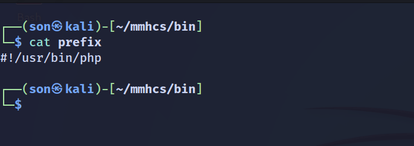
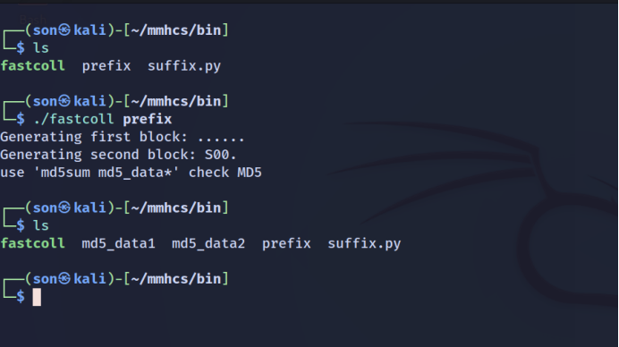
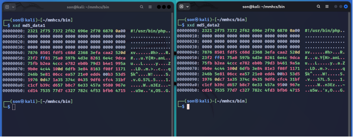
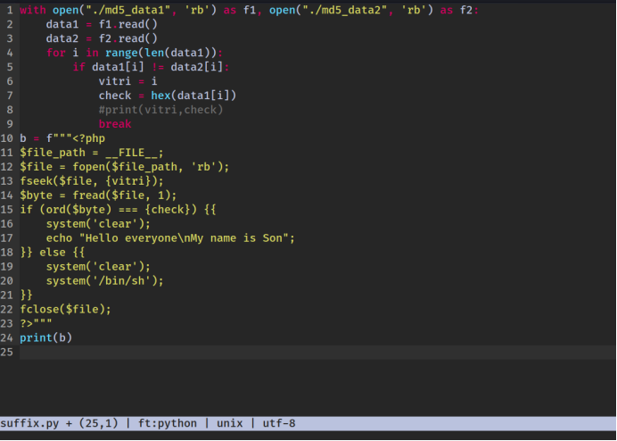
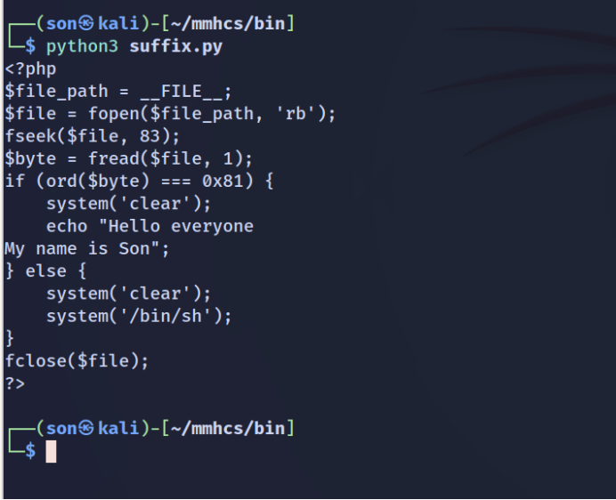
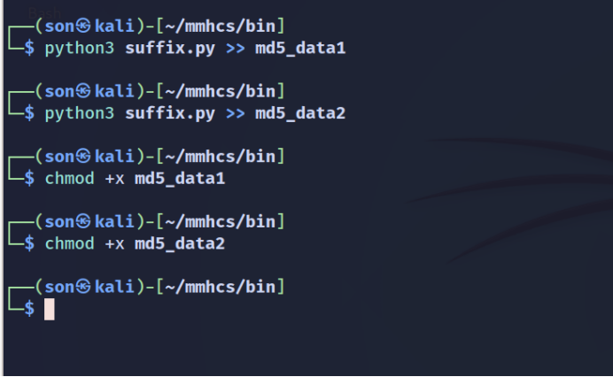
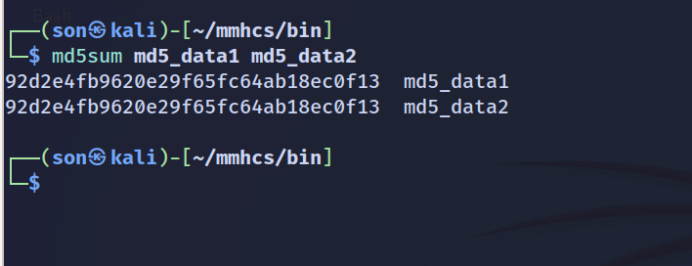
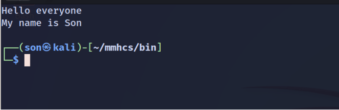
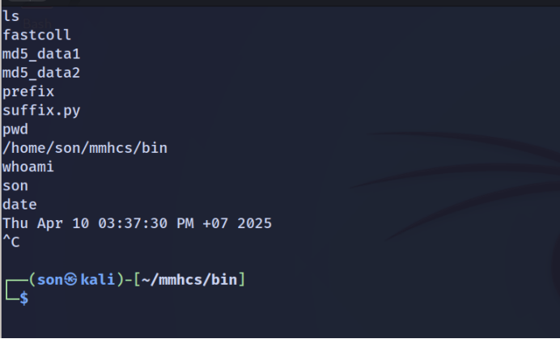

# 🔐 MD5 Collision Attack Demo


> Demo thực tế tấn công va chạm trên hàm băm MD5: tạo hai tệp thực thi có cùng mã băm nhưng hành vi hoàn toàn khác nhau.

---

## 🧠 Tổng Quan

Tấn công va chạm (collision attack) cho phép tạo **hai thông điệp khác nhau** nhưng có cùng **hash MD5**.

Cấu trúc:

```text
prefix + collisionA + suffix
prefix + collisionB + suffix
```

Do tính chất *length extension* của MD5, việc thêm `suffix` giống nhau sau phần `collision` không làm thay đổi giá trị băm. Điều này cho phép:

- Hai file khác nhau.
- Cùng một mã băm.
- Hành vi khác biệt khi thực thi.

---

## 🎯 Mục Tiêu

Tạo 2 file:

| Tên file     | Hành vi khi thực thi                |
|--------------|--------------------------------------|
| `md5_data1`  | In ra dòng thông báo đơn giản.       |
| `md5_data2`  | Mở shell `/bin/sh`.                  |

---

## ⚙️ Các Bước Thực Hiện

### 📌 1. Tạo prefix

<details>
<summary>📁 Nội dung file <code>prefix</code></summary>

```php title="prefix"
#!/usr/bin/php
<?php
```


</details>

---

### ⚡ 2. Tạo phần collision với fastcoll

Clone công cụ:

```bash
git clone https://github.com/brimstone/fastcoll
cd fastcoll
make
```

Tạo collision:

```bash
fastcoll -p prefix -o md5_data1 md5_data2
```

  


---

### ✍️ 3. Thêm mã độc lập vào phần `suffix`

```python title="add_suffix.py"
with open("md5_data1", "ab") as f:
    f.write(b'echo "Hello from benign file!";\n')

with open("md5_data2", "ab") as f:
    f.write(b'system("/bin/sh");\n')
```

  


---

### 🧩 4. Gắn suffix vào cuối file

```bash
python3 add_suffix.py
```



---

### ✅ 5. Kiểm tra mã băm

```bash
md5sum md5_data1
md5sum md5_data2
```

> 🎉 Kết quả: **2 file có cùng mã băm MD5**



---

### 🚀 6. Thực thi và kiểm chứng

- **File 1: `md5_data1`**

  Kết quả: in ra dòng chữ.

  

- **File 2: `md5_data2`**

  Kết quả: mở shell `/bin/sh`.

  

---

## 🧯 Kết Luận

- MD5 không còn an toàn để sử dụng trong các hệ thống cần xác thực dữ liệu, chữ ký số hoặc kiểm tra tính toàn vẹn file.
- Tấn công va chạm MD5 có thể bị lợi dụng để giả mạo dữ liệu hoặc vượt qua hệ thống xác minh đơn giản.

---

## 📜 License

This project is licensed under the MIT License.
