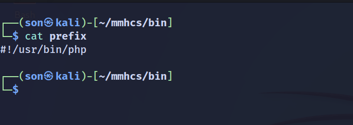
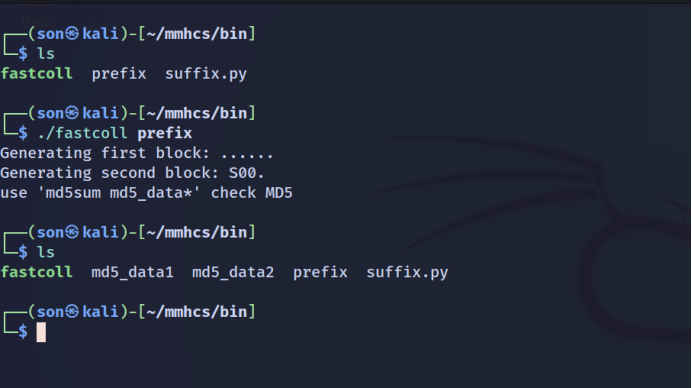
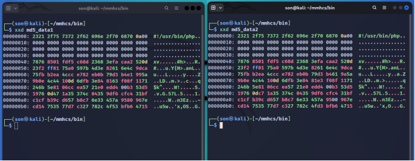
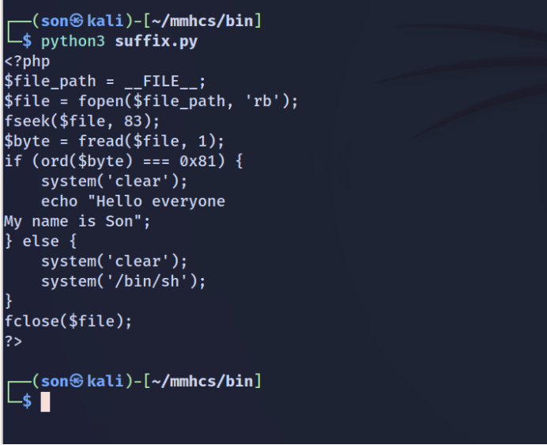
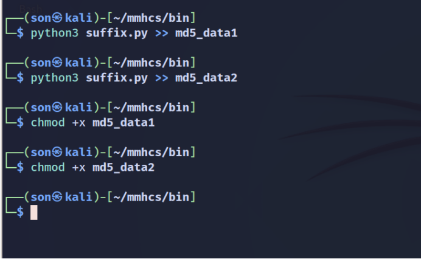
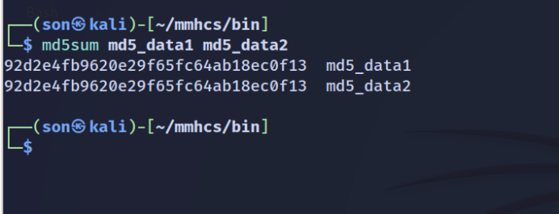
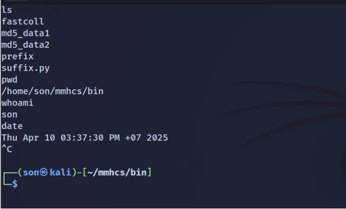

# collision_attack_md5
CHƯƠNG 7. DEMO TẤN CÔNG VA CHẠM TRÊN HÀM BĂM MD5

7.1. Cơ sở lý thuyết

Tấn công va chạm cho phép chúng ta tạo ra hai thông điệp có cùng hàm băm MD5 và cùng một tiền tố tùy chọn (giống nhau). Do hành vi mở rộng độ dài (length-extension) của MD5, chúng ta có thể nối thêm bất kỳ hậu tố nào vào cả hai thông điệp và vẫn đảm bảo rằng các thông điệp dài hơn đó cũng sẽ có cùng giá trị băm. Điều này cho phép ta tạo ra các tệp khác nhau chỉ ở phần “collision” ở giữa, nhưng có cùng giá trị băm MD5, tức là có dạng:

prefix + collisionA + suffix

prefix + collisionB + suffix

Chúng ta có thể tận dụng điều này để tạo ra hai chương trình có cùng hàm băm MD5 nhưng có hành vi hoàn toàn khác nhau. 

7.2. Các bước thực hiện

Ta sẽ tiến hành tạo 2 file thực thi có mã băm md5 giống hệt nhau nhưng nội dung hoàn toàn khác nhau. 1 file sẽ in ra màn hình 1 đoạn thông báo đơn giản, còn 1 file sẽ mở shell /bin/sh
Trước tiên, ta cần tạo file prefix với nội dung là 1 shebang để thự thi các đoạn mã php

Để tạo phần collision, ta sử dụng công cụ fastcoll: https://github.com/brimstone/fastcoll

fastcoll là một công cụ nổi tiếng được viết bằng ngôn ngữ C++ bởi Marc Stevens dùng để tạo các đoạn collision từ 1 đầu vào prefix

Với phần suffix, ta dùng đoạn mã python sau để tạo các đoạn code php tùy chỉnh cho 2 file thực thi

Tiến hành chèn phần suffix vào cuối 2 file thực thi 

Kiểm tra mã băm md5 của 2 file, ta thấy chúng giống hệt nhau

Tuy nhiên, khi ta thực thi 2 file, kết quả lại hoàn toàn khác nhau

Với file md5_data1, khi thực thi màn hình chỉ in một đoạn thông báo

Với file md5_data2, khi thực thi ta nhận được một shell /bin/sh

